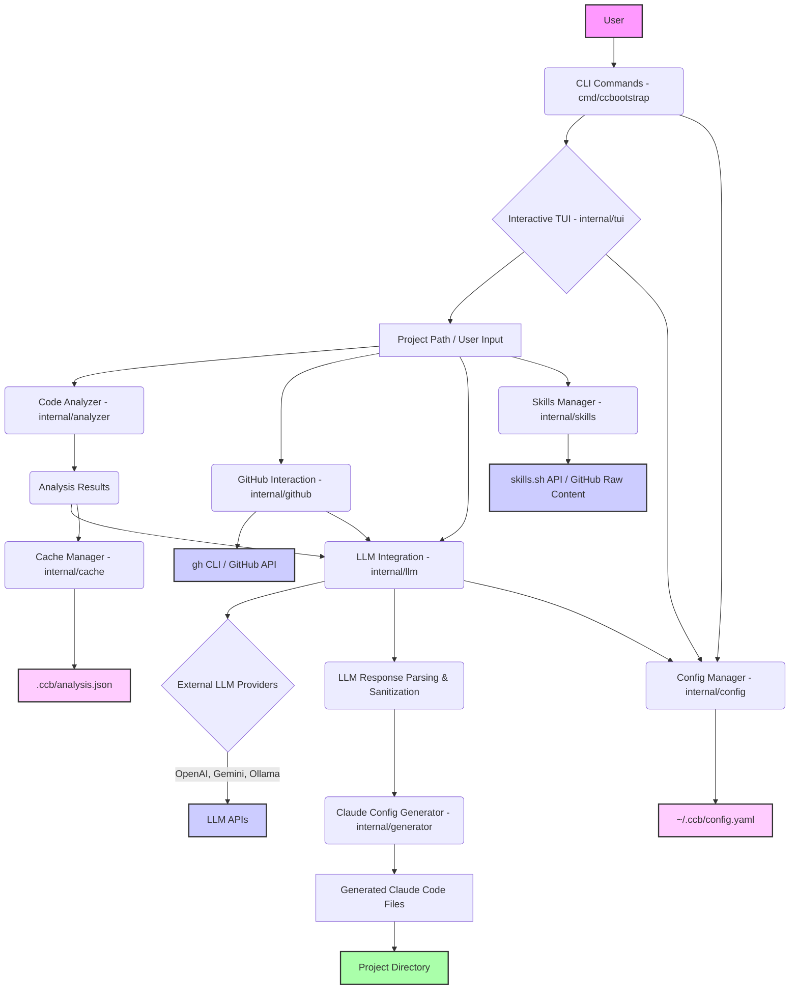

# `ccb` (Claude Code Bootstrapper) Architecture

`ccb` is a native macOS Apple Silicon CLI application written in Go, designed to automate the generation of Claude Code configurations for any given GitHub repository or local project. It combines static code analysis, interactive TUI workflows, and external LLM integrations to provide a tailored AI assistance setup.

## Overall Architecture

The `ccb` application follows a modular, layered architecture:

1.  **CLI Layer (`cmd/ccbootstrap`)**: Handles command-line parsing using `spf13/cobra` and orchestrates the application's flow based on user input.
2.  **Interactive UI Layer (`internal/tui`)**: Provides a rich Terminal User Interface (TUI) using `charmbracelet/bubbletea` for interactive wizards and progress displays.
3.  **Core Logic Layer (`internal/analyzer`, `internal/generator`, `internal/github`, `internal/skills`)**: Contains the business logic for code analysis, file generation, GitHub interactions, and skill discovery.
4.  **AI Integration Layer (`internal/llm`)**: Acts as an abstraction layer for interacting with various external LLM providers, handling prompt engineering, context management, and robust response parsing/sanitization.
5.  **Data Management Layer (`internal/config`, `internal/cache`)**: Manages global user configurations and caches project analysis results.

This architecture ensures a clear separation of concerns, making the application maintainable, testable, and extensible.

## Module Breakdown

### `cmd/ccbootstrap`

*   **Purpose**: Defines the entry point for the `ccb` CLI application. It uses the `spf13/cobra` framework to define all top-level commands (e.g., `init`, `update`, `uninstall`) and their subcommands, flags, and execution logic.
*   **Responsibilities**: Parses command-line arguments, orchestrates the flow by calling functions in `internal/` packages, and handles global flags.

### `internal/analyzer`

*   **Purpose**: Performs static code analysis on a target codebase to extract relevant information for AI processing.
*   **Responsibilities**: Detects programming languages (Go), counts lines of code, identifies testing frameworks, CI/CD configurations, Dockerfiles, and `.env` files. Extracts semantic context (e.g., module names, key directories) to inform LLM prompts.

### `internal/cache`

*   **Purpose**: Manages the caching of AI-generated project analysis results and other transient data.
*   **Responsibilities**: Stores and retrieves analysis data (e.g., `analysis.json`) to avoid redundant LLM calls and speed up subsequent runs. Handles cache invalidation and migration from legacy formats.

### `internal/config`

*   **Purpose**: Handles loading, saving, and migration of user and project configurations.
*   **Responsibilities**: Manages global user settings (AI keys, models, UI preferences) stored in `~/.ccb/config.yaml` and project-specific settings (e.g., `deny` patterns) in `.claude/settings.json`. Includes logic for migrating configurations from older versions.

### `internal/generator`

*   **Purpose**: Responsible for writing the final Claude Code configuration files to disk.
*   **Responsibilities**: Takes LLM-generated content (e.g., agents, rules, skills, `CLAUDE.md`, `docs/architecture.md`) and combines it with deterministic templates. Writes these files to the target project directory, handling file overwrite strategies.

### `internal/github`

*   **Purpose**: Provides utilities for interacting with GitHub.
*   **Responsibilities**: Wraps the `gh` (GitHub CLI) tool for operations like repository cloning, authentication status checks, fetching commit counts, and parsing repository names. Facilitates pull request creation.

### `internal/llm`

*   **Purpose**: Offers a unified, robust interface for calling various LLM providers.
*   **Responsibilities**: Builds prompts, manages context (file selection, ranking, truncation based on `MaxContextChars`), makes HTTP API calls to OpenAI, Google Gemini, or Ollama. Critically, it includes sophisticated JSON sanitization (`sanitizeJSONStrings`) and a custom plain-text file block parser (`scanFileBlocks`) to handle diverse and often inconsistent LLM outputs.

### `internal/skills`

*   **Purpose**: Interacts with the `skills.sh` platform for skill discovery and retrieval.
*   **Responsibilities**: Searches for Claude Code skills via `https://skills.sh/api/search` and fetches raw `SKILL.md` content directly from GitHub repositories (e.g., `https://raw.githubusercontent.com/.../SKILL.md`).

### `internal/tui`

*   **Purpose**: Provides reusable Terminal User Interface components.
*   **Responsibilities**: Implements interactive elements like spinners, banners, progress bars, and colored output using `charmbracelet/bubbletea` and `charmbracelet/lipgloss` to ensure a consistent and engaging user experience.

## Data Flow

1.  **Initialization**: User runs `ccb init <repo_path>`. `cmd/ccbootstrap` parses this, and `internal/tui` presents an interactive wizard.
2.  **Code Analysis**: `internal/analyzer` scans the `<repo_path>`, generating `AnalysisResults` (stack, LOC, modules, etc.).
3.  **AI-Driven Wizard**: `AnalysisResults` and user input from `internal/tui` are fed into `internal/llm` to generate context-aware questions and proposals for Claude Code configurations.
4.  **LLM Interaction**: `internal/llm` constructs prompts, sends them to configured LLM providers (OpenAI, Gemini, Ollama), and robustly parses their responses, often in the plain-text file block format or JSON.
5.  **Skill Discovery**: If needed, `internal/skills` queries `skills.sh` and fetches `SKILL.md` content.
6.  **Configuration Generation**: Based on LLM outputs, analysis results, and user choices, `internal/generator` assembles the final `CLAUDE.md`, `.claude/` directory structure, and `docs/architecture.md`.
7.  **File Writing**: `internal/generator` writes these files to the target project directory, potentially overwriting existing files.
8.  **GitHub Operations**: `internal/github` uses the `gh` CLI for tasks like cloning the repository initially or creating a PR with the generated files.
9.  **Caching**: `internal/cache` stores `AnalysisResults` and LLM outputs to speed up future runs.
10. **Configuration Management**: `internal/config` loads and saves global settings (`~/.ccb/config.yaml`) and project-specific settings (`.claude/settings.json`).

## External Services

*   **skills.sh**: A web service providing a catalog and API for discovering and fetching Claude Code skills. `ccb` uses its API to search for skills and directly fetches raw `SKILL.md` content from GitHub.
*   **GitHub**: The primary platform for target repositories. `ccb` relies on the `gh` CLI for user authentication, repository cloning, fetching raw file content (e.g., `SKILL.md`), and creating pull requests.
*   **OpenAI**: A leading LLM provider used for AI-driven code analysis, question generation, and content generation. `ccb` interacts with its `chat/completions` API.
*   **Google Gemini**: An alternative LLM provider, offering similar capabilities to OpenAI. `ccb` integrates with its `generateContent` API.
*   **Ollama**: A local LLM runtime that allows users to run AI models on their machine. `ccb` supports integration with Ollama's local API, providing an offline and potentially more cost-effective LLM option.
*   **Homebrew**: The macOS package manager used by `ccb`'s `install.sh` script to install runtime dependencies like `git`, `gh`, `jq`, and `node`.
*   **npx**: A Node.js package runner used to execute the `skills` CLI for installing skills, often invoked by `ccb` as part of the skill integration process.